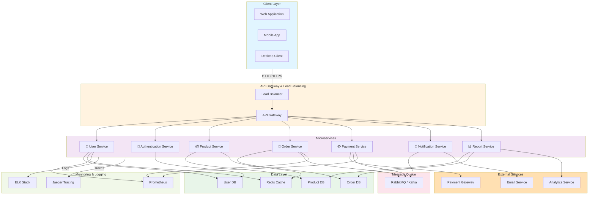

# 微服务架构 (Microservices Architecture)

## Architecture Overview

This diagram illustrates a comprehensive microservices architecture with multiple service layers, data stores, and external integrations.

## Architecture Components

### Client Layer
- **Web Application**: Browser-based user interface
- **Mobile App**: Native or cross-platform mobile application
- **Desktop Client**: Desktop application client

### API Gateway & Load Balancing
- **Load Balancer**: Distributes incoming traffic across multiple API gateways
- **API Gateway**: Single entry point for all client requests, handles authentication, rate limiting, and request routing

### Microservices
- **User Service**: Manages user profiles and account information
- **Authentication Service**: Handles user authentication and authorization
- **Product Service**: Manages product catalog and inventory
- **Order Service**: Processes and manages customer orders
- **Payment Service**: Handles payment processing and transactions
- **Notification Service**: Sends emails, SMS, and push notifications
- **Report Service**: Generates analytics and business reports

### Data Layer
- **User DB**: Database for user information
- **Product DB**: Database for product information
- **Order DB**: Database for order transactions
- **Redis Cache**: In-memory caching for improved performance

### Message Queue
- **RabbitMQ / Kafka**: Asynchronous communication between services for event-driven architecture

### External Services
- **Payment Gateway**: Third-party payment processing (Stripe, PayPal, etc.)
- **Email Service**: Email delivery service (SendGrid, AWS SES, etc.)
- **Analytics Service**: External analytics platform

### Monitoring & Logging
- **Prometheus**: Metrics collection and monitoring
- **ELK Stack**: Elasticsearch, Logstash, Kibana for centralized logging
- **Jaeger**: Distributed tracing for request flow analysis

## Key Benefits

✅ **Scalability**: Each service can be scaled independently  
✅ **Flexibility**: Different services can use different tech stacks  
✅ **Resilience**: Failure in one service doesn't bring down the entire system  
✅ **Rapid Development**: Teams can work on services independently  
✅ **Easy Deployment**: Individual services can be deployed without full system redeployment  

## Communication Patterns

- **Synchronous**: HTTP/REST for direct service-to-service calls
- **Asynchronous**: Message queues for event-driven communication
- **Caching**: Redis for frequently accessed data
